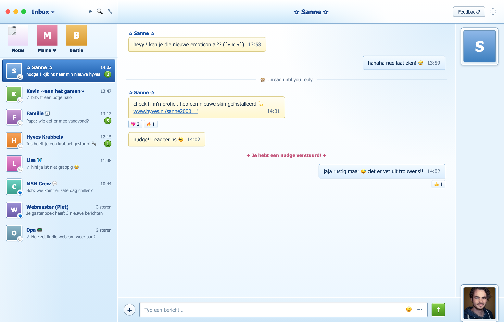

# Beeper Y2K Theme 💾💬

A playful Y2K theme for [Beeper](https://www.beeper.com/) Desktop, inspired by MSN Messenger nudges, Hyves profiles, glossy Web 2.0 buttons, and early-2000s internet nostalgia.

This build (`custom.css`) leans into a nostalgic **MSN Messenger 6/7 (Windows XP)** look: baby-blue gradients, chunky glossy buttons, square avatar frames, a classic contact-list rail, and that unmistakable XP blue. It only restyles Beeper's existing UI — no fake buttons, menus, or notifications are added.

## Preview

- Baby-blue XP-style gradients across the sidebar, header, and conversation panes
- Glossy green "send" button and unread badges, just like the old Messenger client
- Square, beveled avatar frames instead of circles
- A dedicated avatar rail on the right side of conversations (desktop width only)
- Classic Tahoma/Verdana system font stack

## Requirements

- **Beeper Desktop v4** (the Matrix-based rewrite). This theme targets the CSS class names used in that version and will not look right on older Beeper builds.

## Installation

1. Open **Beeper Desktop**.
2. Go to **Settings** → **Appearance** (or **Preferences** → **Appearance**, depending on your version).
3. Scroll down to the **Custom CSS** section.
4. Download or copy the contents of [`custom.css`](./custom.css) from this repo.
5. Paste the full contents into the Custom CSS box in Beeper.
6. Save/apply. Beeper will re-render immediately — no restart needed.

### Updating the theme

When this repo is updated, just re-copy the new `custom.css` contents and paste them over your existing Custom CSS in Beeper's settings.

### Removing the theme

Clear out the Custom CSS box in **Settings → Appearance** and save, or replace it with your own CSS.

## Notes

- Written for **light mode** — `color-scheme` is pinned to `light` so it stays consistent even if your OS is in dark mode.
- Uses `!important` liberally to reliably override Beeper's default styling; expect it to need occasional updates if Beeper changes its internal class names.
- If something looks broken after a Beeper update, please open an issue with a screenshot.

## License

Personal theme, shared as-is for anyone who misses the sound of a nudge. No warranty — use at your own risk of nostalgia overload.
