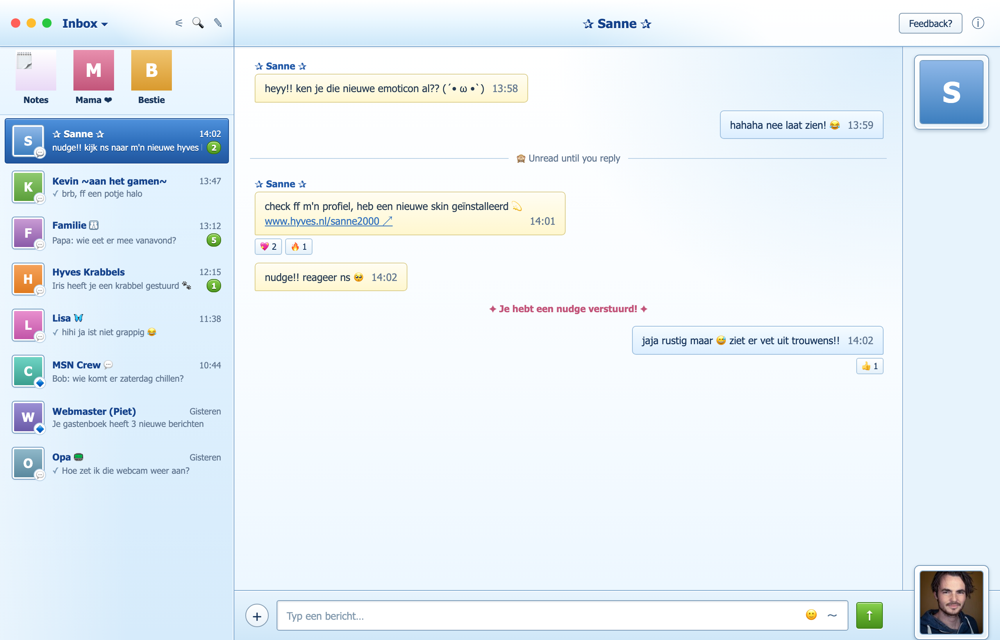

# Beeper Y2K Theme 💾💬

A playful Y2K theme for [Beeper](https://www.beeper.com/) Desktop, inspired by MSN Messenger nudges, Hyves profiles, glossy Web 2.0 buttons, and early-2000s internet nostalgia.

This theme recreates the nostalgic **MSN Messenger 6/7 on Windows XP** look with baby-blue gradients, chunky glossy buttons, square avatar frames, a classic contact-list rail, and that unmistakable XP blue.

It only restyles Beeper’s existing interface—no fake buttons, menus, or notifications are added.

## Preview



- Baby-blue XP-style gradients across the sidebar, header, and conversation panes
- Glossy green send button and unread badges inspired by the classic Messenger client
- Square, bevelled avatar frames instead of circles
- A dedicated avatar rail on the right side of conversations on wider screens
- Classic Tahoma and Verdana system fonts

## Requirements

- **Beeper Desktop v4**, the Matrix-based rewrite
- **Light mode** is recommended

The theme targets the CSS class names used in Beeper Desktop v4 and will not display correctly on older Beeper versions.

## Installation

### Automatic updates — recommended

1. Open **Beeper Desktop**.
2. Go to **Settings → Appearance** or **Preferences → Appearance**, depending on your version.
3. Scroll down to the **Custom CSS** section.
4. Paste the following line at the top of the Custom CSS box:

```css
@import url("https://cdn.jsdelivr.net/gh/dominiquevm/beeper-y2k-theme@latest/custom.css");
```

5. Save or apply your changes.

Beeper should apply the theme immediately without requiring a restart.

This URL loads the latest tagged release through jsDelivr. New releases are picked up automatically, although CDN caching may cause a short delay before an update becomes visible.

If you want to add your own CSS overrides, place them underneath the `@import` line.

### Manual installation

If you prefer to control when the theme is updated:

1. Open [`custom.css`](./custom.css).
2. Copy the complete contents of the file.
3. Open **Beeper → Settings → Appearance → Custom CSS**.
4. Paste the CSS into the Custom CSS box.
5. Save or apply your changes.

With this method, updates are not installed automatically. Repeat these steps whenever you want to use a newer version.

## Recommended appearance setting

For the closest visual match, select the **green accent colour** in **Settings → Appearance**.

This makes the sidebar counters match the unread badges in the chat list and helps polls blend in more naturally with regular messages.

## Updating the theme

- **Automatic installation:** No action is required. The latest tagged release will be loaded automatically after the CDN cache refreshes.
- **Manual installation:** Copy the latest contents of `custom.css` and replace the existing CSS in Beeper.

## Removing the theme

Clear the Custom CSS box in **Settings → Appearance** and save your changes.

If you have added personal CSS underneath the import, remove only the following line to disable the theme while keeping your own changes:

```css
@import url("https://cdn.jsdelivr.net/gh/dominiquevm/beeper-y2k-theme@latest/custom.css");
```

## Notes

- The theme is designed for **light mode**. Its `color-scheme` is pinned to `light` so it remains consistent even when your operating system uses dark mode.
- It uses `!important` where necessary to override Beeper’s default styling.
- Beeper updates may change internal CSS class names and temporarily break parts of the theme.
- If something looks broken after a Beeper update, please [open an issue](https://github.com/dominiquevm/beeper-y2k-theme/issues) and include a screenshot.

## License

A personal theme shared as-is for anyone who misses the sound of a nudge.

No warranty—use at your own risk of nostalgia overload.

## Acknowledgements

A big shout-out to [@red9350](https://github.com/red9350) for suggesting the automatic jsDelivr installation method and recommending the green accent colour setup in [issue #1](https://github.com/dominiquevm/beeper-y2k-theme/issues/1). 💚
